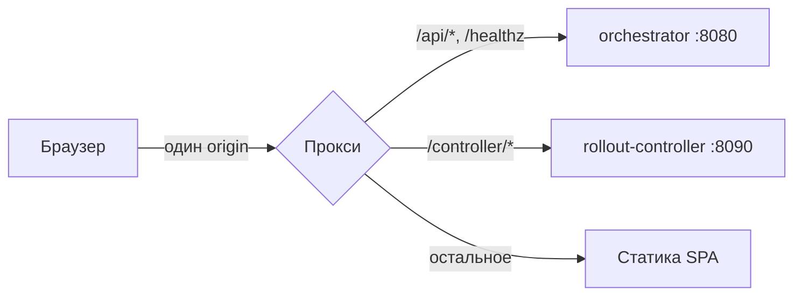

# frontend

Веб-консоль канареечной раскатки прошивок: стадии, метрики и откат в браузере.

> [!NOTE]
> Это не отдельный проект, а пакет монорепозитория [OTA Firmware Orchestrator](../README.md).



В dev проксирует Vite, в контейнере Caddy. Приложение ходит только на относительные пути.

## Содержание

- [Быстрый старт](#быстрый-старт)
- [Демо](#демо)
- [Возможности](#возможности)
- [Как это работает](#как-это-работает)
- [Архитектура](#архитектура)
- [Разработка](#разработка)
- [Конфигурация](#конфигурация)
- [API](#api)
- [Тестирование](#тестирование)
- [Статус и план](#статус-и-план)
- [Ограничения](#ограничения)

## Быстрый старт

**1. Стек** - поднимите бэкенд по разделу «Быстрый старт» корневого README: оркестратор на `:8080` обязателен, без него консоль показывает баннер «API недоступен».

**2. Консоль** - все команды под `bun`, из каталога `frontend/`:

```bash
cd frontend
bun install
bun run dev
```

**3. Открыть** - интерфейс на `http://localhost:5173`, API проксируется на оркестратор.

## Демо

Главный цикл за 3 минуты на полном стеке: обзор, кампания, пауза, асинхронный откат.

1. **Обзор** на маршруте `/`: активные раскатки со стадиями, панель «Требуют внимания», здоровье системы в верхней полосе. Опрос раз в 30 секунд, подпись «обновлено N с назад» тикает сама.
2. **Кампании** на маршруте `/campaigns`: поиск по моделям и сортировка клиентские, по загруженной странице; вход в кампанию кликом или Enter. Кнопки-иконки в колонке «Действия»: открыть, пауза/возобновление/запуск, откат.
3. **Кампания** на маршруте `/campaigns/<id>`: воронка стадий, метрики контроллера, история переходов, JSON-ответ как он есть. Живая кампания опрашивается каждые 3 секунды.
4. **Песочница** на маршруте `/lab`: предсказание бакета для пары идентификаторов и батч на 20 устройств. Клиентский расчет совпадает с серверным.
5. **Пауза, затем откат**: пауза применяется сразу; откат отвечает асинхронно, экран показывает статус «применяем», затем `rolled_back`. Статус никогда не меняется оптимистично.

> [!TIP]
> Остановите оркестратор: поверх кэшированных данных появится баннер «API недоступен», кнопка «Повторить» вернет все без перезагрузки. Остановка контроллера видна в верхней полосе, а на странице живой кампании метрики покажут «недоступно», не ноль.

## Возможности

- **Обзор парка раскаток**: активные кампании, требующие внимания, здоровье оркестратора и контроллера
- **Кампании**: создание со стадиями, старт, пауза, возобновление, асинхронный откат
- **Устройства и прошивки**: списки с серверными фильтрами, создание, декомиссия, checkin/report из песочницы
- **Живые метрики**: воронка стадий, доля успешных чек-инов с порогом, прогресс выборки, история переходов
- **Песочница** на маршруте `/lab`: предсказание вердикта чек-ина и батч-прогон без записи в базу
- **Стилевод** на маршруте `/ui`: все примитивы интерфейса в одном месте
- **Горячие клавиши**: `?` справка, `/` поиск, `g` затем `o/c/d/f/l` переходы, `r` обновить, `t` тема, `Esc` закрыть
- **Темы и адаптив**: светлая/темная без вспышки, списки схлопываются в карточки ниже 768px

## Как это работает

1. Компонент вызывает функцию из `src/lib/api/endpoints.ts` и ходит на относительный путь своего origin
2. В dev проксирует Vite, в проде Caddy: `/api/*` и `/healthz` уходят на оркестратор, `/controller/*` на health-эндпоинт контроллера
3. Чтение идет через `createResource`: поллинг цепочкой `setTimeout` с джиттером, отмена предыдущего запроса, стоп в скрытой вкладке, старые данные сохраняются при сбое
4. Мутации паузы и отката уходят тем же клиентом; экран перечитывает ресурс вместо подмены статуса, откат опрашивается каждые 1.5 секунды до 20 секунд
5. Сетевые сбои поднимают глобальный баннер, сбои ответа показывает экранный `ErrorState`, тексты ошибок уже переведены из `ApiError`

## Архитектура

- **API-слой**, код в `src/lib/api/`: клиент, 15 типизированных функций, перевод ошибок; схема `schema.d.ts` генерируется из `../ota-orchestrator/api/openapi.yaml`
- **Состояние**, код в `src/lib/state/`: `resource.svelte.ts` единственная обертка загрузки, `paged-resource` списки, `campaign-details` агрегатор деталей, `campaign-actions` мутации
- **Экраны** в `src/lib/screens/` и `src/routes/`: `/` обзор, `/campaigns`, `/campaigns/new`, `/campaigns/[id]`, `/devices`, `/firmware`, `/lab`, `/ui`
- **UI-примитивы**, код в `src/lib/ui/`: одна таблица `DataTable.svelte` на все списки, кнопки, диалоги, скелетоны
- **Логика** в `src/lib/domain/`, `src/lib/logic/`, `src/lib/format/` и `src/lib/viz/`: статусы, переходы, semver, inline-SVG без библиотек
- **Поставка** (`Dockerfile`, `Caddyfile`): `oven/bun:1.4.2-alpine` собирает статику, `caddy:2.11-alpine` отдает `/srv`

Детали опроса, токенов и таблиц - в [`docs/ARCHITECTURE.md`](docs/ARCHITECTURE.md).

## Разработка

| Команда | Что делает |
|---|---|
| `bun run dev` | dev-сервер `:5173` с прокси на оркестратор |
| `bun run check` | `svelte-check`, цель 0 ошибок / 0 предупреждений |
| `bun run lint` | `prettier --check` и ESLint |
| `bun run test` | юнит-тесты Vitest |
| `bun run build` | статическая сборка в `build/` |
| `bun run gen:api` | перегенерация `schema.d.ts` из спеки |

```bash
bun install            # зависимости строго по bun.lock
bun run dev            # dev-сервер :5173
# ...правки в src/**...
bun run check          # типы
bun run lint           # стиль
bun run test           # тесты
bun run build          # контрольная сборка
```

Куда класть новое: экран в `src/routes/<маршрут>/+page.svelte` плюс виджеты в `src/lib/screens/<имя>/`; переиспользуемый контрол в `src/lib/ui/`; чистая логика в `src/lib/domain/` или `src/lib/logic/` с тестом рядом; реактивное состояние в `src/lib/state/*.svelte.ts`; новый вызов API только функцией в `src/lib/api/endpoints.ts`. `schema.d.ts` руками не правится: изменился контракт, запустите `bun run gen:api` и закоммитьте результат, иначе упадет docker-сборка. Коммиты по правилам репозитория: на русском, conventional commits со скоупом `frontend`.

> [!NOTE]
> `bun run preview` поднимается с тем же прокси, что и dev, поэтому годится для локальной проверки сборки, но не для деплоя: в контейнере статику отдает Caddy.

## Конфигурация

Приложению переменные не нужны: `frontend/.env.example` пустой, сборка и запуск работают без env-файла. Переменная на другой origin сломала бы same-origin и потребовала CORS.

| Переменная | Где | Дефолт |
|---|---|---|
| `VITE_DEV_UPSTREAM` | прокси Vite в dev/preview | `http://localhost:8080` |
| `VITE_DEV_CONTROLLER_UPSTREAM` | прокси Vite для `/controller/*` | `http://localhost:8090` |
| `ORCHESTRATOR_UPSTREAM` | Caddy в контейнере | `ota-orchestrator:8080` |
| `CONTROLLER_UPSTREAM` | Caddy в контейнере | `rollout-controller:8090` |
| `TRUSTED_PROXIES` | Caddy, для `X-Forwarded-For` | `static private_ranges` |
| `FRONTEND_PORT` | корневой `.env`, порт хоста | `3000` |

Ловушка: `localhost:8080` внутри контейнера на хост не попадает никогда; если оркестратор запущен на хосте, используйте `host.docker.internal:8080`. Версия и момент сборки попадают в футер через `define` в `vite.config.ts`: `__APP_VERSION__` и `__BUILD_TIME__`.

## API

Эндпоинты, тела запросов и коды ответов - в корневом README и полной спеке [`../ota-orchestrator/api/openapi.yaml`](../ota-orchestrator/api/openapi.yaml). Здесь только то, что напрямую определяет поведение интерфейса: общего числа записей нет, поэтому пейджер только «Назад/Дальше», где признак следующей страницы - `rows.length === limit`; фильтры только точного совпадения, у списка кампаний фильтра по статусу нет вовсе; превышение `limit` дает `400`; `stats` кампании необязателен, без него метрики показываются как недоступные; откат асинхронный.

## Тестирование

| Уровень | Команда |
|---|---|
| Типы | `bun run check` |
| Стиль | `bun run lint` |
| Юнит | `bun run test` |
| Сборка | `bun run build` |

Один файл: `bun run test -- src/lib/domain/status.test.ts`. Запреты стиля проверяет `project-rules.test.ts`: без hex, `any`, тире и стрелок в исходниках. Контракт темы проверяет `theme-contract.test.ts`. Оба теста запускаются тем же `bun run test` и падают сами при нарушении.

## Ограничения

- Общего числа записей нет: пейджер «Назад/Дальше»
- Фильтры и сортировки кампаний клиентские, внутри загруженной страницы
- Журнал песочницы живет до перезагрузки: эндпоинта истории попыток нет
- Аутентификации и ролей нет: только закрытый контур
- Серверного рендера нет: первые данные после ответа API, на медленной сети LCP зависит от него
